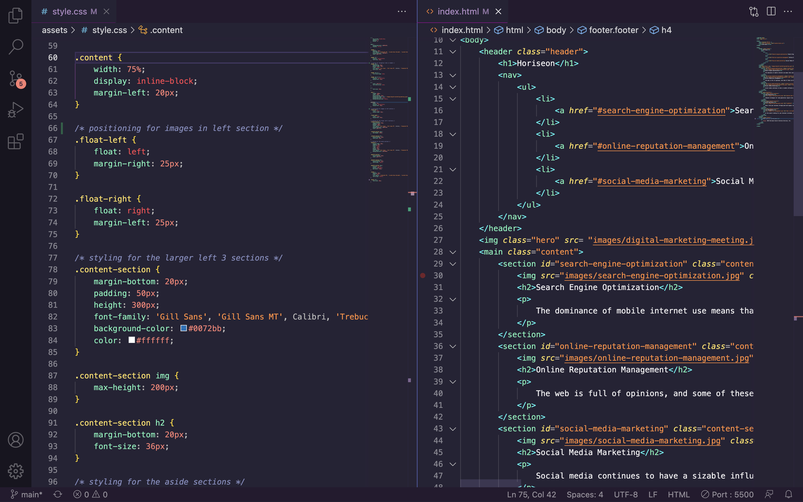

# Challenge 1

## **Description**

Week one challenge focused on accessibility. We were provided starter code that was fully functioning but not accessible due to the lack of semantic HTML elements. My goal was to clean up and fix the code to make it accessible and easier for others to read.

## **How** 

I made the code accessible by replacing the multiple 'div' elements with proper semantic HTML elements. ex: replacing the multiple 'div' elements with 'section' or 'aside'. I also consolidated the CSS properties and classes to make the code cleaner and easier to navigate for other developers.

## **Why**

By using the proper semantic HTML elements it helps search engines and other user devices to understand the importance and context of what is on the page. Code that uses semantic elements offers a better user experience and is much easier for other developers to read.

## **What I Learned**

During this challenge I learned the importance of semantic HTML elements and how they make code more accessible. I also learned what semantic HTML tags are most appropriate for each block of code.

>### To view the deployed site click [here](https://sadiemantlo.github.io/challenge-1/#social-media-marketing) 